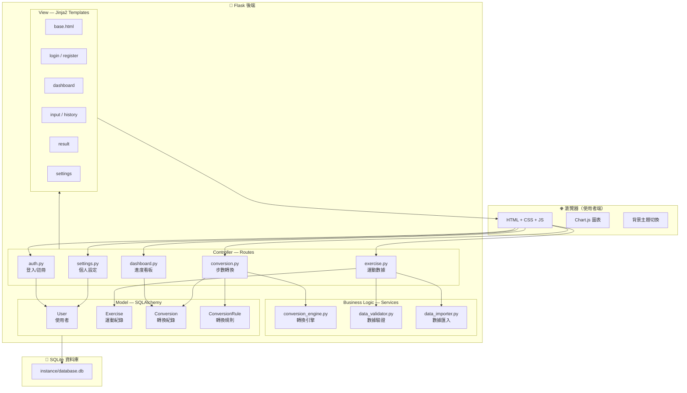
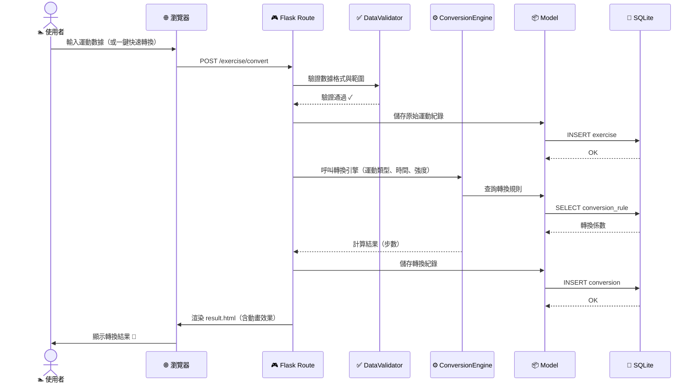
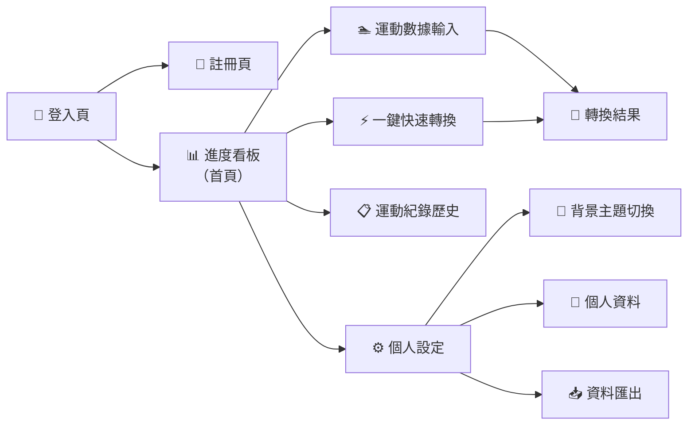

# 系統架構設計 — 皮克敏水性類型運動換算步數系統

> **文件版本**：v1.0  
> **建立日期**：2026-05-09  
> **對應 PRD**：docs/PRD.md  

---

## 1. 技術架構說明

### 1.1 選用技術與原因

| 技術 | 用途 | 選擇原因 |
|------|------|---------|
| **Python 3.10+** | 程式語言 | 語法簡潔易讀，適合快速開發，社群資源豐富 |
| **Flask 3.x** | 後端框架 | 輕量級微框架，適合中小型專案，學習曲線低 |
| **Jinja2** | 模板引擎 | Flask 內建，支援模板繼承與過濾器，方便管理頁面 |
| **SQLite** | 資料庫 | 無需額外安裝資料庫伺服器，以檔案形式儲存，適合開發與小規模部署 |
| **SQLAlchemy** | ORM | 簡化資料庫操作，提供物件關係映射，減少 SQL 注入風險 |
| **Flask-Login** | 身份驗證 | 處理使用者登入/登出/Session 管理 |
| **bcrypt** | 密碼加密 | 業界標準的密碼雜湊演算法，確保安全性 |
| **Chart.js** | 前端圖表 | 輕量級圖表庫，用於運動數據視覺化 |
| **HTML5 + CSS3 + JS** | 前端介面 | 標準網頁技術，搭配 Jinja2 做伺服器端渲染（SSR） |

### 1.2 Flask MVC 模式說明

本專案採用 **MVC（Model-View-Controller）** 架構模式：

```
┌─────────────────────────────────────────────────────────────┐
│                        瀏覽器 (Browser)                      │
│                    使用者操作介面與互動                        │
└──────────────────────────┬──────────────────────────────────┘
                           │ HTTP Request
                           ▼
┌─────────────────────────────────────────────────────────────┐
│                  Controller（Flask Routes）                   │
│                                                             │
│  • 接收 HTTP 請求（GET / POST）                               │
│  • 處理業務邏輯（步數轉換計算、資料驗證）                       │
│  • 呼叫 Model 存取資料庫                                      │
│  • 選擇對應的 View（Jinja2 模板）回傳                          │
│                                                             │
│  檔案位置：app/routes/                                       │
└───────┬─────────────────────────────────┬───────────────────┘
        │                                 │
        ▼                                 ▼
┌───────────────────┐         ┌───────────────────────────────┐
│  Model（SQLAlchemy）│         │    View（Jinja2 Templates）    │
│                   │         │                               │
│  • 定義資料表結構   │         │  • HTML 頁面模板               │
│  • 資料 CRUD 操作   │         │  • 接收 Controller 傳入的資料   │
│  • 商業邏輯封裝     │         │  • 渲染成完整 HTML 回傳瀏覽器    │
│                   │         │                               │
│  位置：app/models/ │         │  位置：app/templates/          │
└────────┬──────────┘         └───────────────────────────────┘
         │
         ▼
┌───────────────────┐
│   SQLite 資料庫    │
│                   │
│  instance/        │
│    database.db    │
└───────────────────┘
```

**資料流向**：
1. 使用者在瀏覽器操作 → 送出 HTTP Request
2. Flask Route（Controller）接收請求並處理邏輯
3. Controller 呼叫 Model 進行資料存取
4. Controller 將結果傳給 Jinja2 Template（View）
5. View 渲染 HTML 頁面回傳給瀏覽器

---

## 2. 專案資料夾結構

```
pikmin-bloom/
│
├── app.py                          ← 應用程式入口，建立 Flask App 並啟動
├── config.py                       ← 設定檔（資料庫路徑、Secret Key 等）
├── requirements.txt                ← Python 相依套件清單
│
├── app/                            ← 主要應用程式目錄
│   ├── __init__.py                 ← Flask App 工廠函式（create_app）
│   │
│   ├── models/                     ← 資料庫模型（Model 層）
│   │   ├── __init__.py
│   │   ├── user.py                 ← 使用者模型（帳號、密碼、偏好設定）
│   │   ├── exercise.py             ← 運動紀錄模型（原始數據）
│   │   ├── conversion.py           ← 步數轉換紀錄模型（轉換結果）
│   │   └── conversion_rule.py      ← 轉換規則模型（公式與係數）
│   │
│   ├── routes/                     ← Flask 路由（Controller 層）
│   │   ├── __init__.py
│   │   ├── auth.py                 ← 登入 / 註冊 / 登出路由
│   │   ├── dashboard.py            ← 進度追蹤看板路由
│   │   ├── exercise.py             ← 運動數據輸入與管理路由
│   │   ├── conversion.py           ← 步數轉換引擎路由
│   │   └── settings.py             ← 個人設定 / 背景主題路由
│   │
│   ├── services/                   ← 業務邏輯服務層
│   │   ├── __init__.py
│   │   ├── conversion_engine.py    ← 步數轉換核心計算邏輯
│   │   ├── data_validator.py       ← 運動數據驗證服務
│   │   └── data_importer.py        ← CSV/JSON 數據匯入服務
│   │
│   ├── templates/                  ← Jinja2 HTML 模板（View 層）
│   │   ├── base.html               ← 基底模板（共用 header/footer/導覽列）
│   │   ├── auth/
│   │   │   ├── login.html          ← 登入頁面
│   │   │   └── register.html       ← 註冊頁面
│   │   ├── dashboard/
│   │   │   └── index.html          ← 進度追蹤看板主頁
│   │   ├── exercise/
│   │   │   ├── input.html          ← 運動數據輸入頁面（含一鍵快速轉換）
│   │   │   └── history.html        ← 運動紀錄歷史列表
│   │   ├── conversion/
│   │   │   └── result.html         ← 轉換結果顯示頁面
│   │   └── settings/
│   │       └── index.html          ← 個人設定 / 背景主題頁面
│   │
│   └── static/                     ← 靜態資源
│       ├── css/
│       │   ├── style.css           ← 全站共用樣式
│       │   └── themes/             ← 背景主題 CSS
│       │       ├── ocean.css       ← 海洋深潛主題
│       │       ├── lake.css        ← 淡水湖泊主題
│       │       ├── pool.css        ← 泳池派對主題
│       │       └── river.css       ← 河流探險主題
│       ├── js/
│       │   ├── main.js             ← 全站共用 JavaScript
│       │   ├── charts.js           ← Chart.js 圖表初始化
│       │   └── quick-convert.js    ← 一鍵快速轉換互動邏輯
│       └── images/
│           ├── pikmin/             ← 皮克敏角色圖片
│           ├── backgrounds/        ← 背景主題圖片
│           └── icons/              ← UI 圖示
│
├── instance/                       ← Flask instance 目錄（不進版控）
│   └── database.db                 ← SQLite 資料庫檔案
│
├── docs/                           ← 專案文件
│   ├── PRD.md                      ← 產品需求文件
│   └── ARCHITECTURE.md             ← 系統架構文件（本文件）
│
└── tests/                          ← 測試目錄
    ├── __init__.py
    ├── test_auth.py                ← 身份驗證測試
    ├── test_conversion.py          ← 步數轉換引擎測試
    └── test_exercise.py            ← 運動數據測試
```

### 各目錄職責總覽

| 目錄/檔案 | 職責 | 對應 MVC |
|-----------|------|---------|
| `app/models/` | 定義資料表結構與資料存取方法 | **Model** |
| `app/routes/` | 處理 HTTP 請求、呼叫服務、回傳頁面 | **Controller** |
| `app/templates/` | HTML 頁面模板，負責呈現資料 | **View** |
| `app/services/` | 核心業務邏輯（轉換引擎、資料驗證） | **Business Logic** |
| `app/static/` | CSS、JS、圖片等靜態資源 | **Assets** |
| `instance/` | SQLite 資料庫（不進版控） | **Data Storage** |
| `tests/` | 單元測試與整合測試 | **Quality Assurance** |

---

## 3. 元件關係圖

### 3.1 系統架構總覽



### 3.2 核心功能資料流 — 步數轉換流程



### 3.3 頁面導覽結構



---

## 4. 關鍵設計決策

### 決策一：採用 Flask Application Factory 模式

**決策**：使用 `create_app()` 工廠函式建立 Flask 應用。

**原因**：
- 支援不同環境（開發/測試/正式）的設定切換
- 方便撰寫單元測試（每個測試建立獨立的 App 實例）
- 避免循環匯入問題
- 是 Flask 官方推薦的最佳實踐

```python
# app/__init__.py
def create_app(config_name='default'):
    app = Flask(__name__)
    app.config.from_object(config[config_name])

    db.init_app(app)
    login_manager.init_app(app)

    from .routes import auth, dashboard, exercise, conversion, settings
    app.register_blueprint(auth.bp)
    app.register_blueprint(dashboard.bp)
    # ...

    return app
```

---

### 決策二：獨立 Services 層處理業務邏輯

**決策**：將步數轉換引擎、數據驗證等核心邏輯抽離至 `app/services/`，不直接寫在 Route 中。

**原因**：
- **單一職責原則**：Route 只負責接收請求與回傳回應，不處理複雜計算
- **可測試性**：轉換引擎可獨立進行單元測試，不需模擬 HTTP 環境
- **可重用性**：同一個轉換引擎可被多個 Route 呼叫（手動輸入、批次匯入、快速轉換）

---

### 決策三：背景主題使用 CSS 變數 + 獨立主題檔

**決策**：使用 CSS Custom Properties（變數）搭配獨立的主題 CSS 檔案來實作背景切換。

**原因**：
- 切換主題只需載入不同的 CSS 檔案，不需修改 HTML 結構
- CSS 變數讓主題色系統一管理，維護簡單
- 使用者選擇的主題儲存在資料庫的 `User.preferred_theme` 欄位
- 頁面載入時根據使用者偏好自動套用

```css
/* style.css — 定義 CSS 變數 */
:root {
    --bg-primary: #1a1a2e;
    --bg-secondary: #16213e;
    --accent-color: #0f3460;
    --text-color: #e0e0e0;
}

/* themes/ocean.css — 覆蓋變數 */
:root {
    --bg-primary: #0a1628;
    --bg-secondary: #0d2137;
    --accent-color: #1e90ff;
    --text-color: #c8e6ff;
}
```

---

### 決策四：轉換規則存放於資料庫而非寫死在程式碼中

**決策**：將各運動類型的轉換公式與係數存放在 `conversion_rule` 資料表中。

**原因**：
- 管理員可動態調整轉換係數，不需重新部署
- 未來新增運動類型時只需新增資料庫記錄
- 方便進行 A/B 測試或根據使用者回饋微調公式
- 程式碼更乾淨，轉換引擎只需讀取規則並計算

---

### 決策五：使用 Flask-Login 管理認證而非自行實作 Session

**決策**：使用 Flask-Login 擴充套件處理使用者認證流程。

**原因**：
- 提供現成的 `@login_required` 裝飾器保護路由
- 自動管理使用者 Session 與 Cookie
- 支援「記住我」功能
- 經過大量專案驗證，安全性較自行實作高
- 降低開發時間與出錯風險

---

## 附錄：技術堆疊版本建議

| 套件 | 建議版本 | 用途 |
|------|---------|------|
| Python | ≥ 3.10 | 主程式語言 |
| Flask | ≥ 3.0 | Web 框架 |
| SQLAlchemy | ≥ 2.0 | ORM |
| Flask-SQLAlchemy | ≥ 3.1 | Flask 整合 SQLAlchemy |
| Flask-Login | ≥ 0.6 | 使用者認證 |
| Flask-WTF | ≥ 1.2 | 表單處理與 CSRF 防護 |
| bcrypt | ≥ 4.0 | 密碼雜湊 |
| Chart.js | ≥ 4.0 | 前端圖表（CDN 載入） |

---

*文件結束 — 請搭配 docs/PRD.md 一起閱讀*
