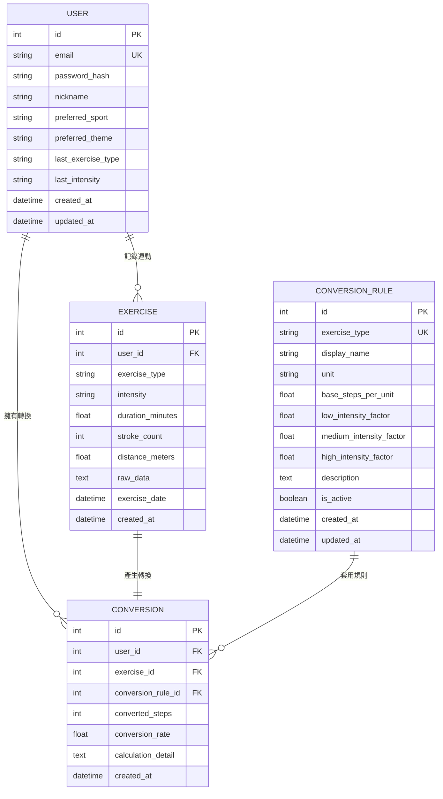

# 資料庫設計 — 皮克敏水性類型運動換算步數系統

> **文件版本**：v1.0  
> **建立日期**：2026-05-09  
> **對應文件**：docs/PRD.md、docs/ARCHITECTURE.md、docs/FLOWCHART.md  

---

## 1. ER 圖（實體關係圖）

---

## 2. 資料表詳細說明

### 2.1 USER（使用者）

儲存使用者帳號與個人偏好設定。

| 欄位 | 型別 | 必填 | 預設值 | 說明 |
|------|------|------|--------|------|
| `id` | INTEGER | ✓ | 自動遞增 | 主鍵（PK） |
| `email` | VARCHAR(120) | ✓ | — | 登入用 Email（唯一） |
| `password_hash` | VARCHAR(255) | ✓ | — | bcrypt 加密後的密碼 |
| `nickname` | VARCHAR(50) | ✓ | — | 顯示暱稱 |
| `preferred_sport` | VARCHAR(30) | ✗ | `'freestyle'` | 慣用運動類型 |
| `preferred_theme` | VARCHAR(20) | ✗ | `'ocean'` | 偏好背景主題 |
| `last_exercise_type` | VARCHAR(30) | ✗ | NULL | 上次使用的運動類型（快速轉換用） |
| `last_intensity` | VARCHAR(10) | ✗ | NULL | 上次使用的運動強度（快速轉換用） |
| `created_at` | DATETIME | ✓ | 當前時間 | 帳號建立時間 |
| `updated_at` | DATETIME | ✓ | 當前時間 | 最後更新時間 |

**索引**：`email`（UNIQUE）

---

### 2.2 EXERCISE（運動紀錄）

儲存使用者上傳的原始運動數據。

| 欄位 | 型別 | 必填 | 預設值 | 說明 |
|------|------|------|--------|------|
| `id` | INTEGER | ✓ | 自動遞增 | 主鍵（PK） |
| `user_id` | INTEGER | ✓ | — | 外鍵 → USER.id |
| `exercise_type` | VARCHAR(30) | ✓ | — | 運動類型（freestyle/breaststroke/backstroke/butterfly/rowing） |
| `intensity` | VARCHAR(10) | ✓ | `'medium'` | 運動強度（low/medium/high） |
| `duration_minutes` | FLOAT | ✗ | NULL | 運動時間（分鐘） |
| `stroke_count` | INTEGER | ✗ | NULL | 划水次數 |
| `distance_meters` | FLOAT | ✗ | NULL | 游泳距離（公尺） |
| `raw_data` | TEXT | ✗ | NULL | 原始匯入數據（JSON 格式） |
| `exercise_date` | DATETIME | ✓ | 當前時間 | 運動日期 |
| `created_at` | DATETIME | ✓ | 當前時間 | 紀錄建立時間 |

**外鍵**：`user_id` → `USER(id)` ON DELETE CASCADE  
**索引**：`user_id`、`exercise_date`

---

### 2.3 CONVERSION（步數轉換紀錄）

儲存每次運動數據經轉換引擎計算後的步數結果。

| 欄位 | 型別 | 必填 | 預設值 | 說明 |
|------|------|------|--------|------|
| `id` | INTEGER | ✓ | 自動遞增 | 主鍵（PK） |
| `user_id` | INTEGER | ✓ | — | 外鍵 → USER.id |
| `exercise_id` | INTEGER | ✓ | — | 外鍵 → EXERCISE.id |
| `conversion_rule_id` | INTEGER | ✓ | — | 外鍵 → CONVERSION_RULE.id |
| `converted_steps` | INTEGER | ✓ | — | 轉換後的步數 |
| `conversion_rate` | FLOAT | ✓ | — | 實際使用的轉換率 |
| `calculation_detail` | TEXT | ✗ | NULL | 計算過程描述（JSON 格式） |
| `created_at` | DATETIME | ✓ | 當前時間 | 轉換時間 |

**外鍵**：
- `user_id` → `USER(id)` ON DELETE CASCADE
- `exercise_id` → `EXERCISE(id)` ON DELETE CASCADE
- `conversion_rule_id` → `CONVERSION_RULE(id)`

**索引**：`user_id`、`exercise_id`、`created_at`

---

### 2.4 CONVERSION_RULE（轉換規則）

儲存各運動類型的步數轉換公式與係數。

| 欄位 | 型別 | 必填 | 預設值 | 說明 |
|------|------|------|--------|------|
| `id` | INTEGER | ✓ | 自動遞增 | 主鍵（PK） |
| `exercise_type` | VARCHAR(30) | ✓ | — | 運動類型代碼（唯一） |
| `display_name` | VARCHAR(50) | ✓ | — | 運動類型顯示名稱（如「自由式游泳」） |
| `unit` | VARCHAR(20) | ✓ | — | 計算單位（minutes/strokes/meters） |
| `base_steps_per_unit` | FLOAT | ✓ | — | 每單位基礎步數 |
| `low_intensity_factor` | FLOAT | ✓ | 0.8 | 低強度調整係數 |
| `medium_intensity_factor` | FLOAT | ✓ | 1.0 | 中強度調整係數 |
| `high_intensity_factor` | FLOAT | ✓ | 1.3 | 高強度調整係數 |
| `description` | TEXT | ✗ | NULL | 規則描述說明 |
| `is_active` | BOOLEAN | ✓ | TRUE | 是否啟用此規則 |
| `created_at` | DATETIME | ✓ | 當前時間 | 建立時間 |
| `updated_at` | DATETIME | ✓ | 當前時間 | 更新時間 |

**索引**：`exercise_type`（UNIQUE）

---

## 3. 關聯關係摘要

| 關聯 | 類型 | 說明 |
|------|------|------|
| USER → EXERCISE | 一對多 | 一個使用者可有多筆運動紀錄 |
| USER → CONVERSION | 一對多 | 一個使用者可有多筆轉換紀錄 |
| EXERCISE → CONVERSION | 一對一 | 每筆運動紀錄對應一筆轉換結果 |
| CONVERSION_RULE → CONVERSION | 一對多 | 一個規則可被多筆轉換引用 |

---

*文件結束 — SQL 建表語法請見 `database/schema.sql`，Model 程式碼請見 `app/models/`*
