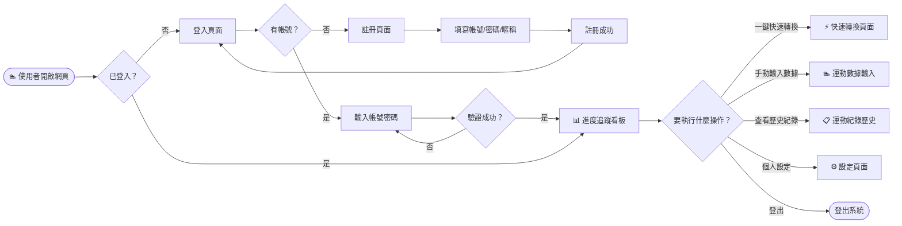
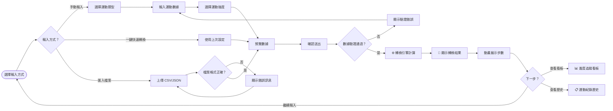
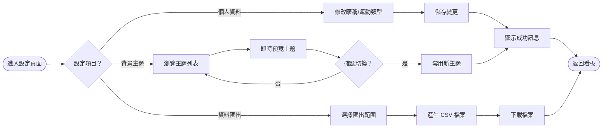
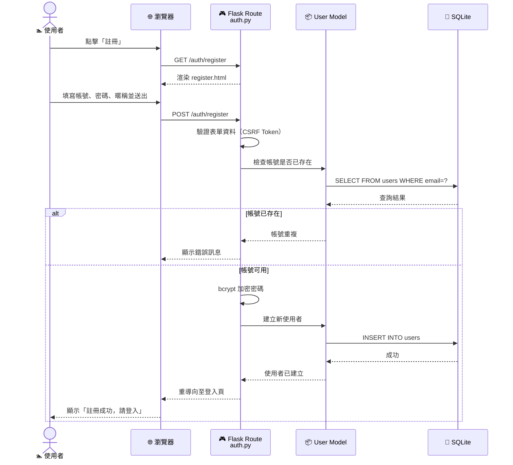
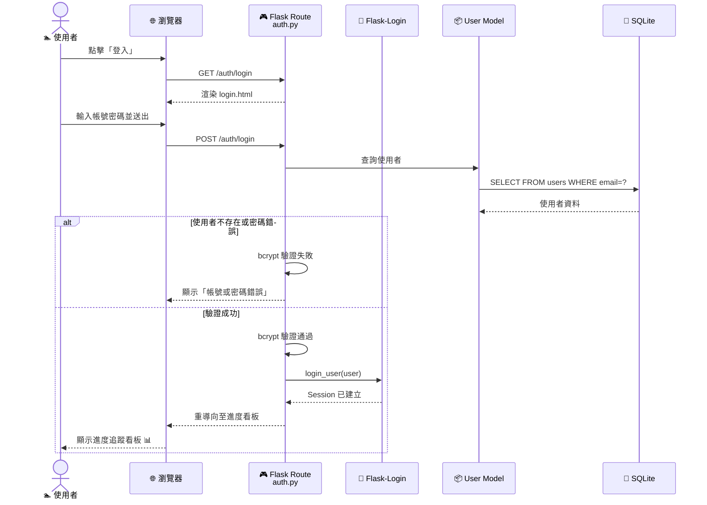
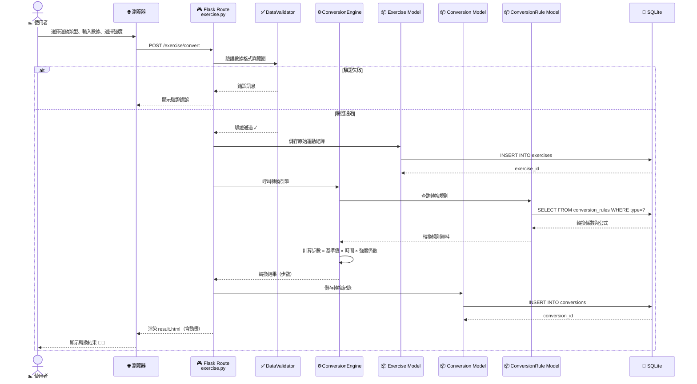
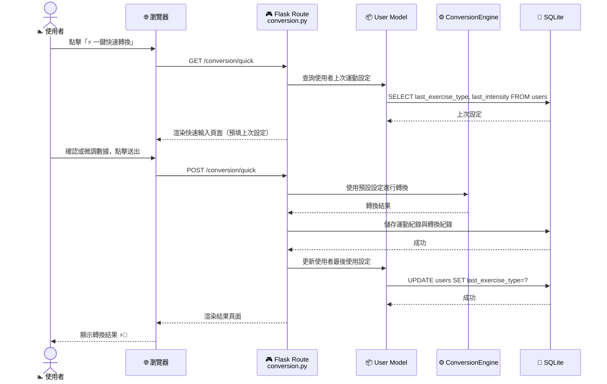
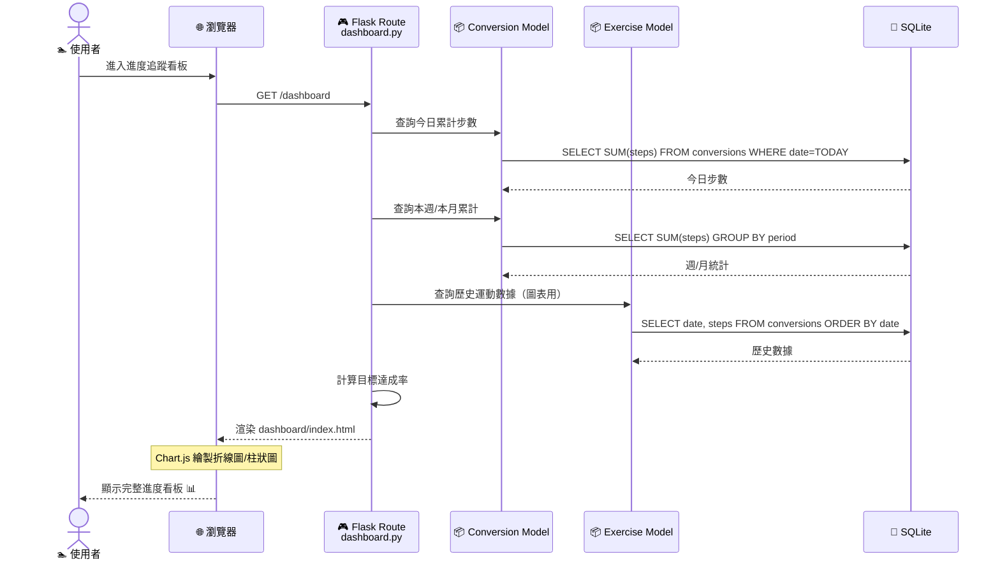

# 流程圖設計 — 皮克敏水性類型運動換算步數系統

> **文件版本**：v1.0  
> **建立日期**：2026-05-09  
> **對應文件**：docs/PRD.md、docs/ARCHITECTURE.md  

---

## 1. 使用者流程圖（User Flow）

### 1.1 整體操作流程

從使用者進入網站到完成核心操作的完整路徑：



### 1.2 運動數據輸入與步數轉換流程



### 1.3 個人設定與背景主題切換流程



---

## 2. 系統序列圖（Sequence Diagram）

### 2.1 使用者註冊流程



### 2.2 使用者登入流程



### 2.3 步數轉換核心流程（手動輸入）



### 2.4 一鍵快速轉換流程



### 2.5 進度看板數據載入流程



---

## 3. 功能清單對照表

### 3.1 認證相關（auth）

| 功能 | URL 路徑 | HTTP 方法 | 說明 |
|------|---------|-----------|------|
| 顯示登入頁面 | `/auth/login` | GET | 渲染登入表單 |
| 登入驗證 | `/auth/login` | POST | 驗證帳密，建立 Session |
| 顯示註冊頁面 | `/auth/register` | GET | 渲染註冊表單 |
| 註冊帳號 | `/auth/register` | POST | 建立新使用者帳號 |
| 登出 | `/auth/logout` | GET | 清除 Session，重導登入頁 |

### 3.2 進度看板（dashboard）

| 功能 | URL 路徑 | HTTP 方法 | 說明 |
|------|---------|-----------|------|
| 看板首頁 | `/dashboard` | GET | 顯示累計步數、目標達成率、圖表 |

### 3.3 運動數據（exercise）

| 功能 | URL 路徑 | HTTP 方法 | 說明 |
|------|---------|-----------|------|
| 運動數據輸入頁 | `/exercise/input` | GET | 渲染運動數據輸入表單 |
| 提交運動數據並轉換 | `/exercise/convert` | POST | 驗證數據 → 儲存 → 轉換 → 顯示結果 |
| 運動紀錄歷史 | `/exercise/history` | GET | 顯示所有歷史運動紀錄與轉換結果 |
| 刪除運動紀錄 | `/exercise/<id>/delete` | POST | 刪除指定運動紀錄及對應轉換 |

### 3.4 步數轉換（conversion）

| 功能 | URL 路徑 | HTTP 方法 | 說明 |
|------|---------|-----------|------|
| 一鍵快速轉換頁面 | `/conversion/quick` | GET | 預填上次設定的快速輸入頁 |
| 執行快速轉換 | `/conversion/quick` | POST | 使用預設設定進行轉換 |
| 轉換結果頁面 | `/conversion/result/<id>` | GET | 顯示指定轉換結果（含動畫） |

### 3.5 個人設定（settings）

| 功能 | URL 路徑 | HTTP 方法 | 說明 |
|------|---------|-----------|------|
| 設定頁面 | `/settings` | GET | 顯示個人設定選項 |
| 更新個人資料 | `/settings/profile` | POST | 修改暱稱、慣用運動類型 |
| 切換背景主題 | `/settings/theme` | POST | 更新使用者偏好主題 |
| 匯出運動數據 | `/settings/export` | GET | 產生並下載 CSV 匯出檔 |

### 3.6 路由總覽

```
/auth/login          GET, POST    ← 登入
/auth/register       GET, POST    ← 註冊
/auth/logout         GET          ← 登出

/dashboard           GET          ← 進度看板（首頁）

/exercise/input      GET          ← 運動數據輸入
/exercise/convert    POST         ← 提交並轉換
/exercise/history    GET          ← 歷史紀錄
/exercise/<id>/delete POST        ← 刪除紀錄

/conversion/quick    GET, POST    ← 一鍵快速轉換
/conversion/result/<id> GET       ← 轉換結果

/settings            GET          ← 設定頁面
/settings/profile    POST         ← 更新資料
/settings/theme      POST         ← 切換主題
/settings/export     GET          ← 匯出數據
```

---

*文件結束 — 所有 Mermaid 圖表可直接在 GitHub 或支援 Mermaid 的編輯器中預覽*
